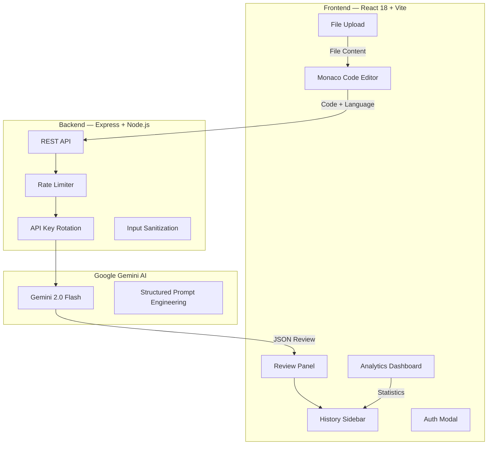

<p align="center">
  
  
  
  
  
  
  
</p>

# 🔍 CodeReview AI — AI-Powered Secure Code Review Platform

> A full-stack code analysis platform powered by **Google Gemini AI** that detects bugs, security vulnerabilities, and performance issues across **16+ programming languages** with an instant, structured review.

---

## ✨ Key Features

| Feature | Description |
|---------|-------------|
| **🤖 AI Code Analysis** | Deep analysis using Google Gemini 2.0 Flash for bug detection, security vulnerabilities, and optimization suggestions |
| **🔒 Security Scanning** | Identifies vulnerabilities with severity levels (critical/high/medium/low) and remediation steps |
| **📝 16+ Languages** | JavaScript, TypeScript, Python, Java, C++, C, C#, Go, Rust, PHP, Ruby, Swift, Kotlin, SQL, HTML, CSS |
| **📊 Code Quality Score** | Numeric 1-10 score with detailed breakdown and positive highlights |
| **✏️ Monaco Editor** | VS Code's editor with syntax highlighting, IntelliSense, and theme support |
| **📂 File Upload** | Drag-and-drop file upload with react-dropzone for analyzing existing files |
| **📜 Review History** | Persistent review history with sidebar navigation using localStorage |
| **📄 PDF Export** | Export review results as formatted PDF reports using html2pdf.js |
| **📈 Analytics Dashboard** | Chart.js visualizations for review statistics and language distribution |
| **🔑 API Key Rotation** | Automatic key rotation with cooldown, retry logic, and error recovery |
| **⚡ Rate Limiting** | Server-side rate limiting (30 req/min) to prevent API abuse |
| **🎨 Modern UI** | Glassmorphism dark theme with responsive layout |

---

## 🏗️ Architecture



---

## 🛠️ Tech Stack

| Layer | Technology |
|-------|-----------|
| **Frontend** | React 18, Vite 5 |
| **Code Editor** | Monaco Editor (same engine as VS Code) |
| **Styling** | Tailwind CSS 3.4 with glassmorphism effects |
| **Charts** | Chart.js + react-chartjs-2 |
| **File Handling** | react-dropzone for drag-and-drop upload |
| **PDF Export** | html2pdf.js |
| **Notifications** | react-hot-toast |
| **Backend** | Node.js + Express 4 |
| **AI Model** | Google Gemini 2.0 Flash |
| **Security** | Rate limiting, input size limits (50MB), CORS, API key rotation |
| **Icons** | Lucide React |

---

## 🚀 Quick Start

### Prerequisites
- Node.js 18+ installed
- Google Gemini API key (FREE — [get one here](https://aistudio.google.com/app/apikey))

### 1. Clone & Setup Backend

```bash
git clone https://github.com/aryan1919-web/ai-code-reviewer.git
cd ai-code-reviewer/backend

npm install

# Create .env file
copy .env.example .env
# Edit .env → add your GEMINI_API_KEY

npm run dev
```

### 2. Setup Frontend

```bash
cd ../frontend
npm install
npm run dev
```

### 3. Open the App
Visit `http://localhost:3000` 🎉

---

## 📁 Project Structure

```
ai-code-reviewer/
├── backend/
│   ├── server.js              # Express server with Gemini AI integration
│   ├── render.yaml            # Render deployment config
│   ├── package.json
│   └── .env.example
├── frontend/
│   ├── src/
│   │   ├── components/
│   │   │   ├── Header.jsx          # App header with navigation
│   │   │   ├── CodeEditor.jsx      # Monaco editor wrapper
│   │   │   ├── ReviewPanel.jsx     # AI review results display
│   │   │   ├── HistorySidebar.jsx  # Review history panel
│   │   │   ├── Dashboard.jsx       # Analytics & statistics
│   │   │   ├── FileUpload.jsx      # Drag-and-drop file input
│   │   │   └── AuthModal.jsx       # Authentication modal
│   │   ├── context/                # React context providers
│   │   ├── utils/                  # Helper utilities
│   │   ├── App.jsx                 # Main application
│   │   └── index.css               # Tailwind + custom styles
│   ├── vercel.json                 # Vercel deployment config
│   ├── tailwind.config.js
│   └── package.json
└── README.md
```

---

## 📊 API Endpoints

| Method | Endpoint | Description | Auth |
|--------|----------|-------------|------|
| `POST` | `/api/review` | Submit code for AI analysis | Rate limited |
| `GET` | `/api/health` | Server health check + key status | Public |
| `GET` | `/api/languages` | List 16 supported languages | Public |

---

## 🔐 Security Features

- **Rate Limiting**: 30 requests per minute per IP via `express-rate-limit`
- **Input Size Limits**: 50MB max payload to prevent abuse
- **API Key Rotation**: Automatic rotation with cooldown (30s) and error tracking
- **CORS Protection**: Configured cross-origin resource sharing
- **Input Sanitization**: Markdown/JSON cleanup on AI responses
- **No API Key Exposure**: Keys stored server-side only via `.env`

---

## 🔧 Environment Variables

| Variable | Description | Required |
|----------|-------------|----------|
| `GEMINI_API_KEY` | Single Google Gemini API key | Yes |
| `GEMINI_API_KEYS` | Comma-separated keys for rotation | Optional |
| `PORT` | Backend server port (default: 5000) | No |

---

## 🎯 Supported Languages

JavaScript · TypeScript · Python · Java · C++ · C · C# · Go · Rust · PHP · Ruby · Swift · Kotlin · SQL · HTML · CSS

---

## 👨‍💻 Author

**Aryan Bhalodiya**
- GitHub: [@aryan1919-web](https://github.com/aryan1919-web)
- LinkedIn: [Aryan Bhalodiya](https://www.linkedin.com/in/aryan-bhalodiya31)

## 📄 License

This project is licensed under the MIT License.

---

⭐ **Star this repo if you found it helpful!**
